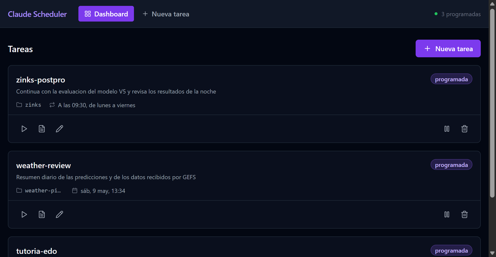

# Claude Scheduler

A local web dashboard to schedule and resume [Claude Code](https://claude.ai/code) sessions across multiple repos. Runs as a hidden background daemon with a system-tray icon.



## Why

Claude Code sessions get buried in your terminal history. If you're juggling work across several repos, it's easy to forget you had an active conversation in one of them. Claude Scheduler keeps a list of pending sessions, lets you set reminders, and at the right time pops open a fresh PowerShell window with `claude --resume <session-id>` already running.

Use it for:
- Reminders to come back to a long-running conversation tomorrow morning
- Recurring agents (e.g. "every weekday at 9am, resume my postprocessing review")
- Keeping context-rich sessions discoverable instead of scrolling shell history

## Features

- **System-tray daemon** — invisible startup, no console clutter. Open dashboard / logs / quit from the tray icon.
- **Scheduling** — one-time at a specific datetime, daily, weekly, or custom cron expression.
- **Smart launch** — if a Claude window for that task is already open, the next firing is skipped instead of duplicating.
- **Real terminal window** — launches Claude in a normal PowerShell window so the interactive UI works as if you'd typed it yourself.
- **Run history** — every fire is recorded with timestamps and the exact command issued.
- **Local-first** — SQLite + JSON files in `data/`. No cloud, no telemetry.

## Requirements

- Windows 10 / 11
- Node.js **22+** (uses the built-in `node:sqlite` module — no native compilation)
- [Claude Code CLI](https://claude.ai/code) installed and accessible as `claude` in your `PATH`

## Setup

```powershell
git clone https://github.com/carsanmilcar/claude-scheduler
cd claude-scheduler
npm install
npm run build
```

## Run it

**Recommended — tray launcher:**

Double-click `scripts\tray.vbs`. After ~3 seconds an icon appears in the system-tray overflow (the `^` arrow on the taskbar). Right-click for the menu:

- **Open Dashboard** → opens `http://localhost:3333`
- **Open Logs Folder** → run logs in `data/logs/`
- **Show Server Log** → opens `data/daemon.log`
- **Quit** → stops the daemon and removes the icon

To auto-start on login, drop a shortcut to `tray.vbs` in `shell:startup`.

**Foreground (visible console):**

```powershell
npm start                 # production
npm run dev               # dev mode with hot reload (UI on :5173, API on :3333)
```

## Usage

1. From the dashboard, click **+ New Task**.
2. Fill in:
   - **Name** — anything memorable
   - **Repo path** — absolute Windows path, e.g. `C:\Users\you\repos\my-project`
   - **Prompt** *(optional)* — initial message Claude receives when the session opens
   - **Session ID** *(optional)* — leave blank to use `--continue` (most recent session in that repo). Paste a UUID to use `--resume <id>`.
   - **Schedule** — *One-time* / *Daily* / *Weekly* / *Custom cron*
3. Save. The dashboard polls every 5 seconds and shows the next firing time.

## Schedule from inside any Claude session (MCP + slash command)

The repo ships an MCP server that exposes a `schedule_session` tool, plus a `/remind` slash command. With both installed, you can register the current conversation in the scheduler from any Claude Code session:

```
/remind mañana 9am — revisa los resultados de la noche
/remind cada lunes 10:00 weekly review
/remind en 30 min sigue donde lo dejamos
```

The MCP auto-detects the current repo from `CLAUDE_PROJECT_DIR` and the session ID from `CLAUDE_CODE_SESSION_ID` — both env vars Claude Code exposes to every subprocess. If `CLAUDE_CODE_SESSION_ID` isn't set, the task falls back to `--continue` (latest session in the repo). If the daemon isn't running when you invoke the tool, it launches `tray.vbs` automatically and waits for it to come up.

**Install:**

```powershell
# 1. Register the MCP server globally
claude mcp add claude-scheduler --scope user -- npx tsx C:\path\to\claude-scheduler\mcp\index.ts

# 2. Copy the slash command into your Claude config
copy commands\remind.md %USERPROFILE%\.claude\commands\
```

After this, `/remind` is available in every Claude Code session on your machine.

## Forget noisy conversations on exit (`/forget`)

Short throwaway sessions (a quick `/remind`, a one-off question) accumulate in `~/.claude/projects/` and clutter the `/resume` picker. The `/forget` command marks the current conversation for deletion when you `/exit`.

How it works:

1. Inside any session, type `/forget`. Claude confirms which session it found and asks you before marking.
2. A flag file is written to `~/.claude/forget-marks/<session-id>.flag` (just a pointer to the JSONL).
3. The `SessionEnd` hook runs `scripts/forget-cleanup.ps1` when you `/exit`, which deletes any marked JSONLs.
4. If a JSONL is still locked (rare on Windows), the flag stays and the next `SessionEnd` retries — eventually consistent.

Run `/forget` again on the same session to undo the mark.

**Install:**

```powershell
copy commands\forget.md %USERPROFILE%\.claude\commands\
```

Add the hook to `~/.claude/settings.json`:

```json
{
  "hooks": {
    "SessionEnd": [
      {
        "matcher": "",
        "hooks": [
          {
            "type": "command",
            "command": "powershell.exe -NoProfile -ExecutionPolicy Bypass -WindowStyle Hidden -File 'C:/path/to/claude-scheduler/scripts/forget-cleanup.ps1'"
          }
        ]
      }
    ]
  }
}
```

### Finding a specific session ID

Claude Code stores conversation history at:

```
%USERPROFILE%\.claude\projects\<encoded-repo-path>\<session-id>.jsonl
```

The filename is the UUID you'd paste into the **Session ID** field. The first line of each file usually contains your opening message, which you can grep to identify the session you want.

Alternatively, run `claude --resume` (no value) inside the repo for an interactive picker.

## Data layout

Everything lives under `data/` (gitignored):

```
data/
  scheduler.db        # SQLite — tasks and run history
  daemon.log          # stdout/stderr of the Node daemon
  tray-error.log      # tray launcher errors (only if startup fails)
  logs/
    <task-id>/
      <run-id>.json   # metadata for each fire (command, timestamps, exit code)
```

Delete `scheduler.db` to start fresh.

## Configuration

Environment variables (read on startup):

| Variable | Default | Notes |
|---|---|---|
| `PORT`     | `3333`   | Port for the HTTP server |
| `DATA_DIR` | `./data` | Where the DB and logs live |
| `NODE_ENV` | unset    | Set to `production` to make Express serve the built React app from the same port |

## Security notes

- ⚠️ The HTTP server **binds to `localhost` without authentication.** Anyone with shell access to your machine can read tasks, trigger runs, or exfiltrate them. Don't expose port 3333 outside your machine, don't run this on a shared host.
- ⚠️ Every Claude run is launched with `--dangerously-skip-permissions`. Tasks have full access to your filesystem and network. Only schedule prompts you'd be comfortable approving manually.

## Architecture

Single Node process exposing:

- **REST API** at `/api/tasks`, `/api/runs`, `/api/health`
- **React dashboard** built by Vite, served as static files in production
- **Scheduler** using `node-cron`: recurring tasks register cron jobs; one-shot tasks are armed and a per-minute poller fires the ones whose `next_run_at` has passed (avoiding setTimeout's 32-bit overflow)
- **Runner** spawns each Claude window via `cmd /c start powershell.exe`, which gives the new process a real attached console so Claude's interactive UI works

The tray launcher (`scripts/tray.ps1`) is a PowerShell script that uses .NET WinForms `NotifyIcon` to put the menu in the system tray and starts the daemon hidden.

## License

MIT — see [LICENSE](LICENSE).
